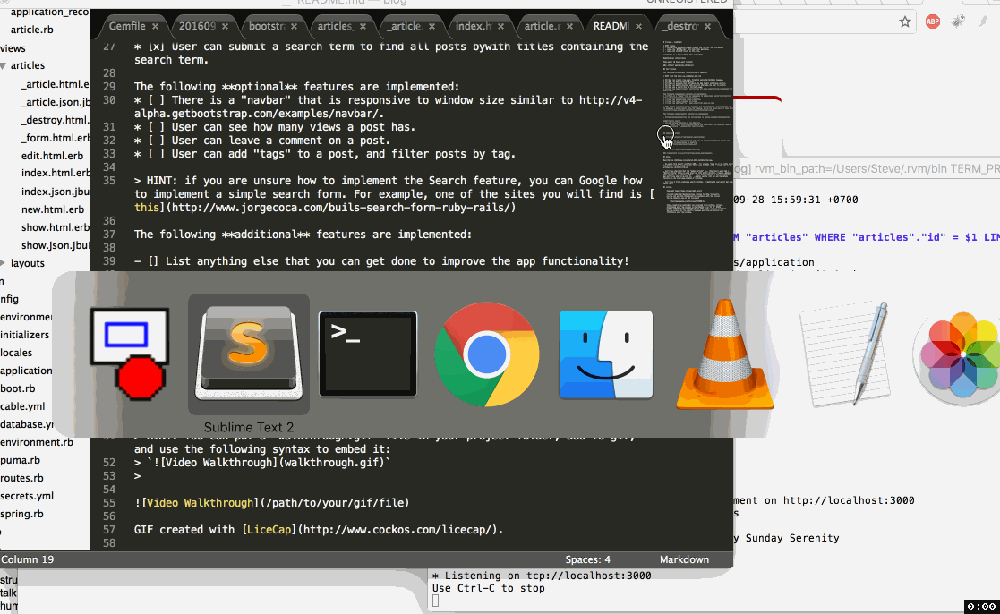

# Pre-work - *csblog1*

**csblog1** is a Ruby on Rails blog application.

Submitted by: **Steve Cho**

Time spent: 10 hours spent in total

URL: **Insert your Heroku URL here**

## User Stories

The following **required** functionality is complete:

* [X] User can create a new post, formatted using the Markdown language.
* [x] User can edit an existing post.
* [x] There is one post that introduces the App Creator with name, picture.
* [x] User can delete stories, with an alert that asks the user to confirm.
* [x] User see a search form on the Posts page.
* [x] User can submit a search term to find all posts bywith titles containing the search term.

The following **optional** features are implemented:
* [ ] There is a "navbar" that is responsive to window size similar to http://v4-alpha.getbootstrap.com/examples/navbar/. 
* [ ] User can see how many views a post has. 
* [ ] User can leave a comment on a post.
* [ ] User can add "tags" to a post, and filter posts by tag. 

> HINT: if you are unsure how to implement the Search feature, you can Google how to implement a simple search form. For example, one of the sites you will find is [this](http://www.jorgecoca.com/buils-search-form-ruby-rails/)

The following **additional** features are implemented:

- [] List anything else that you can get done to improve the app functionality!

**Here is the list**
- Can add "delete" function on the edit part. 
- Also, have a "show" full article, that on the index page, only displays like up to 250 characters or whatever for long articles. 

## Video Walkthrough CHECK

Here's a walkthrough of implemented user stories:

GIF created with [LiceCap](http://www.cockos.com/licecap/).

## Notes

Challenges encountered while building the app.

- My search form doesn't work full 100%... for example, "App" is on one title and I put that in search, and it doesn't return that specific post... no idea why as of writing this (9-28-16 2:49 pm)

- Don't know where the fuck the "Update Article" is... otherwise I would add a "Delete Article" button in same place but with delete function. I have a _delete.html.erb file in my articles folder... and a delete defined in the controller(?) but don't know what to do with it.  - update: sep 28, 3:16 pm: got the delete function on the index page display of articles. 

- Ever since I tried creating a search function, it duplicated some posts? but only twice? WTF?!

## License

    Copyright [yyyy] [name of copyright owner]

    Licensed under the Apache License, Version 2.0 (the "License");
    you may not use this file except in compliance with the License.
    You may obtain a copy of the License at

        http://www.apache.org/licenses/LICENSE-2.0

    Unless required by applicable law or agreed to in writing, software
    distributed under the License is distributed on an "AS IS" BASIS,
    WITHOUT WARRANTIES OR CONDITIONS OF ANY KIND, either express or implied.
    See the License for the specific language governing permissions and
    limitations under the License.